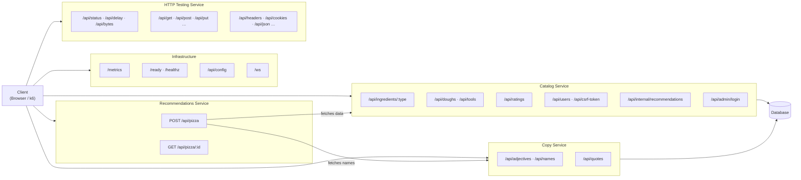
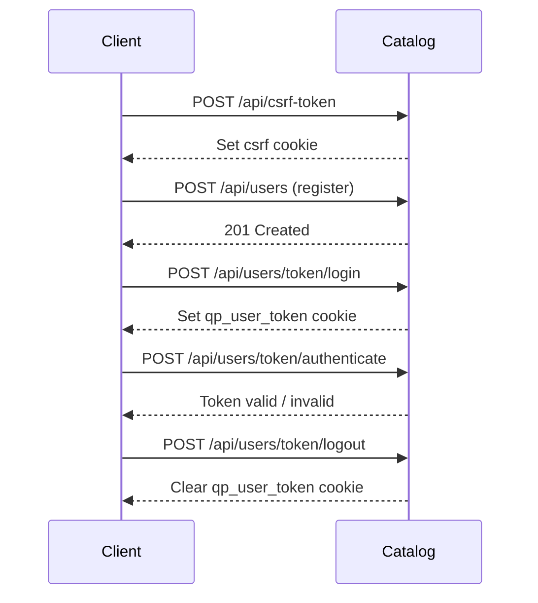
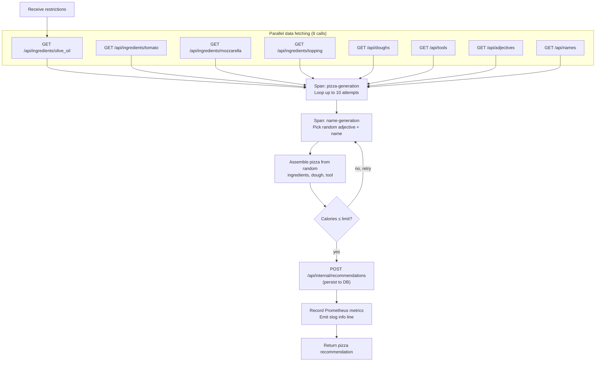
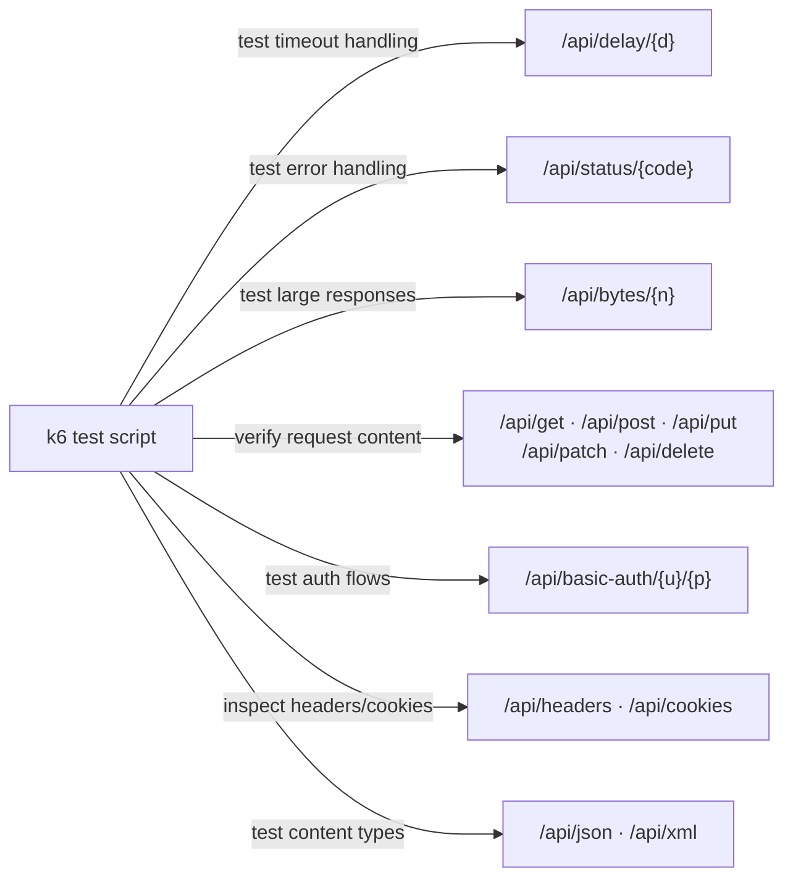
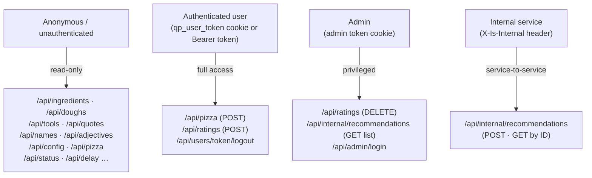

# QuickPizza: API Endpoint Reference

## Service Overview

Each service owns a distinct slice of the URL space. The diagram below shows which services expose which path prefixes and what external systems they depend on.



---

## Catalog Service

Owns all persistent data: ingredients, doughs, tools, users, ratings, and the final stored pizza records.

### Ingredients, Doughs & Tools

| Method | Path | Purpose |
|---|---|---|
| `GET` | `/api/ingredients/{type}` | Return available ingredients for a given category. Used by the Recommendations service to build the ingredient pool. |
| `GET` | `/api/doughs` | Return available dough types. |
| `GET` | `/api/tools` | Return available cooking tools (oven, pan, etc.). |

Valid `type` values for ingredients:

```
olive_oil  ·  tomato  ·  mozzarella  ·  topping
```

### Ratings

| Method | Path | Purpose |
|---|---|---|
| `POST` | `/api/ratings` | Submit a rating for a pizza recommendation. |
| `GET` | `/api/ratings` | List all ratings. |
| `GET` | `/api/ratings/{id}` | Fetch a single rating. |
| `PUT` / `PATCH` | `/api/ratings/{id}` | Update a rating. |
| `DELETE` | `/api/ratings/{id}` | Delete a single rating. |
| `DELETE` | `/api/ratings` | Delete all ratings (admin). |

### User Authentication



| Method | Path | Purpose |
|---|---|---|
| `POST` | `/api/csrf-token` | Issue a CSRF cookie required for cookie-based requests. |
| `POST` | `/api/users` | Register a new user account. |
| `POST` | `/api/users/token/login` | Authenticate and set the `qp_user_token` session cookie. |
| `POST` | `/api/users/token/logout` | Clear the session cookie. |
| `POST` | `/api/users/token/authenticate` | Verify whether a token is valid. Used internally by the Recommendations service middleware. |

### Internal & Admin

| Method | Path | Auth required | Purpose |
|---|---|---|---|
| `POST` | `/api/internal/recommendations` | `X-Is-Internal` header | Persist a completed pizza generated by the Recommendations service. Not for direct client use. |
| `GET` | `/api/internal/recommendations/{id}` | `X-Is-Internal` header | Retrieve a single stored recommendation. |
| `GET` | `/api/internal/recommendations` | Admin token cookie | List full recommendation history. |
| `POST` / `GET` | `/api/admin/login` | — | Issue an admin token for privileged operations. |

---

## Copy Service

Provides the raw text material used to construct creative pizza names. No business logic — pure data retrieval.

| Method | Path | Purpose |
|---|---|---|
| `GET` | `/api/adjectives` | Return a list of adjectives (e.g. "Crispy", "Ancient"). Combined with a classical name to form the pizza name. |
| `GET` | `/api/names` | Return a list of classical names used as the second word in a pizza name. |
| `GET` | `/api/quotes` | Return flavour-text quotes displayed in the UI. Not used in pizza generation itself. |

Pizza names are assembled as: **`{adjective} {name}`** — e.g. *"Ancient Pythagoras"*.

---

## Recommendations Service

The only service that contains business logic. Orchestrates calls to Catalog and Copy, runs the generation algorithm, and returns a complete pizza recommendation.

### `POST /api/pizza` — Generate a pizza

**Request body:**
```json
{
  "maxCaloriesPerSlice": 600,
  "mustBeVegetarian": false
}
```

**Algorithm:**



**Response:**
```json
{
  "pizza": {
    "name": "Ancient Pythagoras",
    "dough": { "name": "Thin", "... ": "..." },
    "ingredients": [ { "name": "Mozzarella", "... ": "..." } ],
    "tool": "Oven"
  },
  "calories": 480,
  "vegetarian": true
}
```

### `GET /api/pizza/{id}` — Retrieve a past recommendation

Proxies to `GET /api/internal/recommendations/{id}` on the Catalog service and returns the stored pizza.

---

## Infrastructure Endpoints

| Method | Path | Purpose |
|---|---|---|
| `GET` | `/ready` | Readiness probe — returns 200 when the service is ready to accept traffic. |
| `GET` | `/healthz` | Liveness probe — returns 200 as long as the process is alive. |
| `GET` | `/metrics` | Prometheus scrape endpoint. Exposes all application metrics including request durations, pizza recommendation counters, and WebSocket stats. |
| `GET` | `/api/config` | Returns all environment variables prefixed with `QUICKPIZZA_CONF_*` as a JSON map. Used to inject runtime configuration into the frontend. |
| `GET` | `/ws` | WebSocket endpoint (Melody). After a pizza is generated, the browser sends a `new_pizza` message here to notify other connected clients in real time. |

---

## HTTP Testing Service

These endpoints exist for k6 load testing workshops. They replicate the behaviour of `httpbin.org` so tests can practice HTTP patterns against a local, controlled target.



| Path | Behaviour |
|---|---|
| `/api/status/{code}` | Returns the specified HTTP status code immediately. |
| `/api/delay/{d}` | Sleeps for duration `d` (e.g. `500ms`, `2s`) before responding. Useful for testing timeout and cancellation logic. |
| `/api/bytes/{n}` | Returns `n` random bytes. Useful for testing handling of large or binary responses. |
| `/api/get` | Echoes the GET request (URL, headers, query params) as JSON. |
| `/api/post` | Echoes the POST request body as JSON. |
| `/api/put` | Echoes the PUT request body as JSON. |
| `/api/patch` | Echoes the PATCH request body as JSON. |
| `/api/delete` | Echoes the DELETE request as JSON. |
| `/api/headers` | Returns the request's headers as JSON. |
| `/api/cookies` | `GET` returns current cookies; `POST` sets cookies. |
| `/api/json` | Converts query parameters to a JSON response. |
| `/api/xml` | Converts query parameters to an XML response. |
| `/api/basic-auth/{u}/{p}` | Returns 200 if the request includes matching Basic Auth credentials, 401 otherwise. |

---

## Endpoint Access Summary


