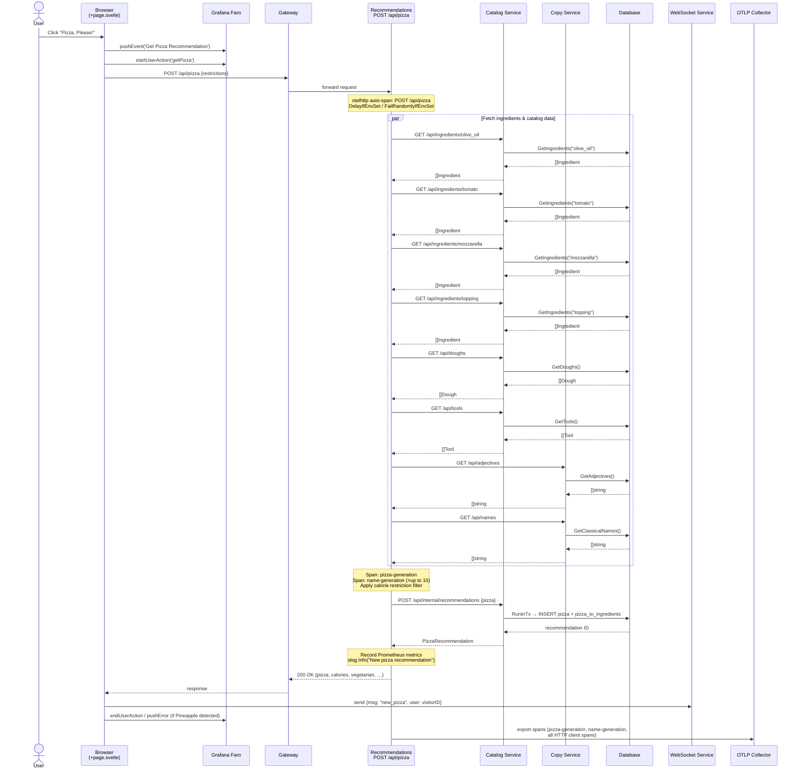
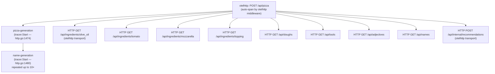
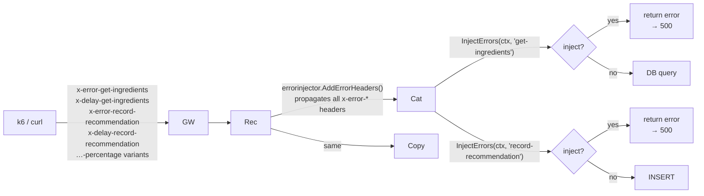
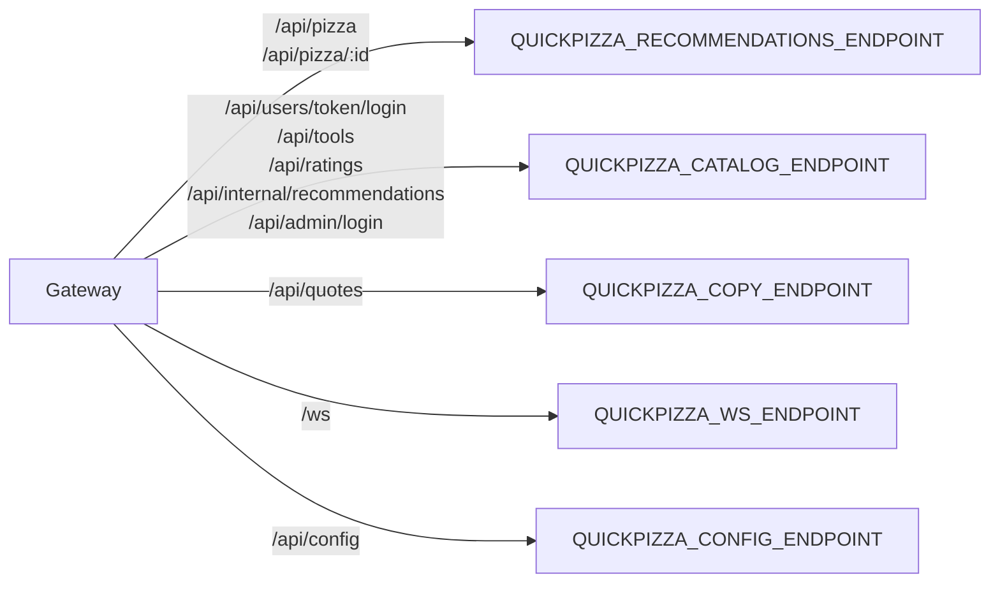

# QuickPizza: Observability & Architecture Guide

## 1. Service Topology

QuickPizza is a modular monolith that can be split into true microservices via environment variables. In monolith mode, all services share one process; in microservice mode, a Gateway proxy routes traffic by URL prefix.

```mermaid
graph TD
    Browser["Browser (SvelteKit)"]
    Faro["Grafana Faro SDK"]

    subgraph QuickPizza Process
        Gateway["Gateway\n(URL-based proxy)"]
        PublicAPI["PublicAPI / Frontend\n(Static assets + SvelteKit SSR)"]
        Recommendations["Recommendations Service\nPOST /api/pizza\nGET /api/pizza/:id"]
        Catalog["Catalog Service\n/api/ingredients/:type\n/api/doughs\n/api/tools\n/api/ratings\n/api/users\n/api/internal/recommendations"]
        Copy["Copy Service\n/api/quotes\n/api/names\n/api/adjectives"]
        WS["WebSocket Service\n/ws"]
        Config["Config Service\n/api/config"]
        HTTPTesting["HTTP Testing Service\n/api/status/:code\n/api/delay/:n\n/api/get  /api/post …"]
        gRPC["gRPC Service\n:3334 / :3335 health"]
    end

    DB[(SQLite / PostgreSQL)]
    OTEL["OTLP Collector"]
    Pyroscope["Pyroscope"]
    Prometheus["Prometheus\n/metrics"]

    Browser -->|"HTTP"| Gateway
    Browser -->|"WS"| WS
    Browser -->|"RUM events"| Faro
    Gateway --> PublicAPI
    Gateway --> Recommendations
    Gateway --> Catalog
    Gateway --> Copy
    Gateway --> WS
    Gateway --> Config

    Recommendations -->|"HTTP client"| Catalog
    Recommendations -->|"HTTP client"| Copy

    Catalog --> DB
    Copy --> DB

    QuickPizza Process -->|"OTLP traces + metrics"| OTEL
    QuickPizza Process -->|"profiling"| Pyroscope
    QuickPizza Process -->|"scrape"| Prometheus
```

**Service enable/disable env vars:**

| Service | Environment Variable | Default |
|---|---|---|
| All services | `QUICKPIZZA_ENABLE_ALL_SERVICES` | `true` |
| Public API / Frontend | `QUICKPIZZA_ENABLE_PUBLIC_API_SERVICE` | on |
| Catalog | `QUICKPIZZA_ENABLE_CATALOG_SERVICE` | on |
| Copy | `QUICKPIZZA_ENABLE_COPY_SERVICE` | on |
| Recommendations | `QUICKPIZZA_ENABLE_RECOMMENDATIONS_SERVICE` | on |
| WebSocket | `QUICKPIZZA_ENABLE_WS_SERVICE` | on |
| Config | `QUICKPIZZA_ENABLE_CONFIG_SERVICE` | on |
| gRPC | `QUICKPIZZA_ENABLE_GRPC_SERVICE` | on |
| HTTP Testing | `QUICKPIZZA_ENABLE_HTTP_TESTING_SERVICE` | on |

---

## 2. Full API Endpoint Map

### Catalog Service (`pkg/http/http.go:800–1247`)
Requires authentication middleware (token or cookie).

| Method | Path | Handler | Notes |
|---|---|---|---|
| `GET` | `/api/ingredients/{type}` | `db.GetIngredients()` | type: `olive_oil`, `tomato`, `mozzarella`, `topping` |
| `GET` | `/api/doughs` | `db.GetDoughs()` | |
| `GET` | `/api/tools` | `db.GetTools()` | |
| `POST` | `/api/ratings` | `db.RecordRating()` | |
| `GET` | `/api/ratings` | `db.GetRatings()` | |
| `GET` | `/api/ratings/{id}` | `db.GetRating()` | |
| `PUT/PATCH` | `/api/ratings/{id}` | `db.UpdateRating()` | |
| `DELETE` | `/api/ratings` | `db.DeleteRatings()` | Admin |
| `DELETE` | `/api/ratings/{id}` | `db.DeleteRating()` | Admin |
| `POST` | `/api/csrf-token` | Generate CSRF cookie | |
| `POST` | `/api/users` | `db.RecordUser()` | Register |
| `POST` | `/api/users/token/login` | `db.LoginUser()` | Sets `qp_user_token` cookie |
| `POST` | `/api/users/token/logout` | Clear cookie | |
| `POST` | `/api/users/token/authenticate` | `db.Authenticate()` | Token verify |
| `POST` | `/api/internal/recommendations` | `db.RecordRecommendation()` | Requires `X-Is-Internal` |
| `GET` | `/api/internal/recommendations/{id}` | `db.GetRecommendation()` | |
| `GET` | `/api/internal/recommendations` | `db.GetHistory()` | Admin token required |
| `POST/GET` | `/api/admin/login` | Generate admin token | |

### Copy Service (`pkg/http/http.go:1250–1306`)

| Method | Path | Handler |
|---|---|---|
| `GET` | `/api/quotes` | `db.GetQuotes()` |
| `GET` | `/api/names` | `db.GetClassicalNames()` |
| `GET` | `/api/adjectives` | `db.GetAdjectives()` |

### Recommendations Service (`pkg/http/http.go:1311–1566`)

| Method | Path | Handler |
|---|---|---|
| `POST` | `/api/pizza` | Main pizza generation (see §3) |
| `GET` | `/api/pizza/{id}` | `catalogClient.GetRecommendation(id)` |

### Observability & Infrastructure

| Method | Path | Purpose |
|---|---|---|
| `GET` | `/ready` | Readiness probe |
| `GET` | `/healthz` | Liveness probe |
| `GET` | `/metrics` | Prometheus scrape endpoint |
| `GET` | `/api/config` | Returns `QUICKPIZZA_CONF_*` env vars |
| `GET` | `/ws` | WebSocket (Melody) |

### HTTP Testing / HTTPBin (`pkg/http/http.go:614–748`)

| Path | Behaviour |
|---|---|
| `/api/status/{code}` | Return given HTTP status |
| `/api/delay/{d}` | Sleep for `d` duration then respond |
| `/api/bytes/{n}` | Return `n` random bytes |
| `/api/get` `/api/post` `/api/put` `/api/patch` `/api/delete` | Echo request |
| `/api/headers` | Echo request headers |
| `/api/cookies` | Get / set cookies |
| `/api/json` `/api/xml` | Query params → JSON / XML |
| `/api/basic-auth/{u}/{p}` | Verify Basic Auth |

---

## 3. "Pizza, Please!" — Full API Call Chain

### 3.1 Sequence Diagram



### 3.2 Internal Span Hierarchy



---

## 4. Observability Instrumentation

### 4.1 Tracing (OpenTelemetry)

| What | Where | Span Name |
|---|---|---|
| Every HTTP request | `otelhttp.NewHandler` on each route group | `METHOD /path` |
| Every outgoing HTTP call | `otelhttp.NewTransport` on HTTP clients | `METHOD` |
| Pizza generation loop | `pkg/http/http.go:1474` | `pizza-generation` |
| Name generation inner loop | `pkg/http/http.go:1480` | `name-generation` |
| Database queries | `bunotel.NewQueryHook` | SQL statement |

Trace ID is logged with every request (`LogTraceID` middleware) and also carried in Prometheus exemplars.

Configuration:

```
QUICKPIZZA_OTLP_ENDPOINT      — collector URL (enables tracing)
QUICKPIZZA_OTEL_SERVICE_NAME  — service.name attribute (default: quickpizza)
QUICKPIZZA_TRUST_CLIENT_TRACEID — honour incoming W3C trace-context
```

### 4.2 Metrics (Prometheus — `/metrics`)

| Metric | Type | Labels |
|---|---|---|
| `quickpizza_server_pizza_recommendations_total` | Counter | `vegetarian`, `tool` |
| `quickpizza_server_number_of_ingredients_per_pizza` | Histogram | — |
| `quickpizza_server_number_of_ingredients_per_pizza_native` | Native Histogram | — |
| `quickpizza_server_pizza_calories_per_slice` | Histogram | — |
| `quickpizza_server_pizza_calories_per_slice_native` | Native Histogram | — |
| `quickpizza_server_http_requests_total` | Counter | `method`, `path`, `status` |
| `quickpizza_server_http_request_duration_seconds` | Histogram | `method`, `path`, `status` |
| `quickpizza_server_http_request_duration_seconds_native` | Native Histogram | `method`, `path`, `status` |
| `quickpizza_server_http_request_duration_seconds_gauge` | Gauge | `method`, `path`, `status` |
| `ws_connections_active` | Gauge | — |
| `ws_connection_duration_seconds` | Native Histogram | — |
| `ws_messages_received_total` | Counter | — |
| `ws_message_processing_duration_seconds` | Native Histogram | — |

All HTTP duration metrics include **trace ID exemplars** for metric↔trace correlation.

### 4.3 Logging (slog / structured JSON)

| Level | Location | Message |
|---|---|---|
| `Info` | `http.go:1564` | `"New pizza recommendation"` + pizza name |
| `Debug` | `http.go:824,830,843` | Ingredient / tool request received |
| `Warn` | `http.go:819` | Unknown ingredient type requested |
| `Error` | `http.go:812,834,847` | Database failures |

SQL queries are logged via `logging.NewBunSlogHook(slog.Default())`.

### 4.4 Frontend Observability (Grafana Faro)

| Event | Trigger |
|---|---|
| `pushEvent('Get Pizza Recommendation')` | Button click |
| `startUserAction('getPizza')` | Before fetch |
| `pushEvent('Navigation', {url})` | Route changes |
| `pushError('Pizza Error: Pineapple detected!')` | Pineapple in ingredients |

### 4.5 Profiling (Pyroscope)

Enabled when `QUICKPIZZA_PYROSCOPE_ENDPOINT` is set. Continuous CPU and memory profiles are pushed from the Go process.

---

## 5. Error Injection

QuickPizza supports controlled chaos via HTTP headers. Headers are stored in request context by middleware and forwarded to every downstream call.



| Header | Effect |
|---|---|
| `x-error-get-ingredients` | Force error on ingredient fetch |
| `x-error-get-ingredients-percentage: 50` | Error 50% of the time |
| `x-delay-get-ingredients: 200ms` | Add 200 ms delay to ingredient fetch |
| `x-error-record-recommendation` | Force error when saving pizza |
| `x-error-record-recommendation-percentage: 25` | Error 25% of the time |
| `x-delay-record-recommendation: 1s` | Add 1 s delay to save |

Environment-level fault injection (no header needed):

| Env Var | Effect |
|---|---|
| `QUICKPIZZA_DELAY_RECOMMENDATIONS_API_PIZZA_POST` | Fixed delay on every POST /api/pizza |
| `QUICKPIZZA_FAIL_RATE_RECOMMENDATIONS_API_PIZZA_POST` | Random failure rate on POST /api/pizza |
| `QUICKPIZZA_DELAY_COPY` | Fixed delay on every Copy service response |

---

## 6. Microservice Deployment — Gateway Routing

When `QUICKPIZZA_ENABLE_ALL_SERVICES=false`, the Gateway reverse-proxies by URL prefix:



Each endpoint is an independent process running the same binary with only its own service flag enabled.

---

## Key File Index

| File | Purpose |
|---|---|
| `cmd/main.go` | Service wiring, env-var flags, OTEL/Pyroscope init |
| `pkg/http/http.go` | All route registration and handlers |
| `pkg/http/client.go` | `CatalogClient` and `CopyClient` HTTP clients |
| `pkg/http/otel.go` | OpenTelemetry initialisation and middleware |
| `pkg/database/catalog.go` | Catalog DB operations (ingredients, pizza, users) |
| `pkg/database/copy.go` | Copy DB operations (names, adjectives, quotes) |
| `pkg/errorinjector/` | Header-based error and delay injection |
| `pkg/grpc/grpc.go` | gRPC server (Status, RatePizza) |
| `pkg/web/src/routes/+page.svelte` | Frontend — `getPizza()` at line 140 |
